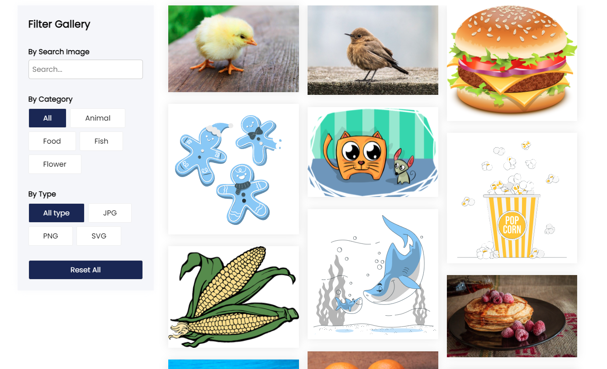

# Advanced Multiple Filter Gallery 

This is almost advanced multiple filterable gallery using Vanilla JavaScript. In this gallery you can filter by the search terms, categories, file type like it's jpg png or svg something like that. If you have a better idea then it please feel free to contribute it and make of your dreams project using this idea thanks

# Using Technologies
~~~
 - HTML5/HTML
 - CSS3/CSS
 - Vanilla JavaScript
 - VS Code Editor
 - Google Fonts (Poppins)
 - Github/Git bash
 - Image from Mr. Web Designer
 and many more
~~~
# Features 
``` 
1. Search Of Your Terms
2. Filter by the category
3. Filter by the Image Type
4. Reset All Button for reset Filter
5. Completely Mobile Responsive.

```


# Demo Screenshot Here 



> Thanks for reach Out me on Github.